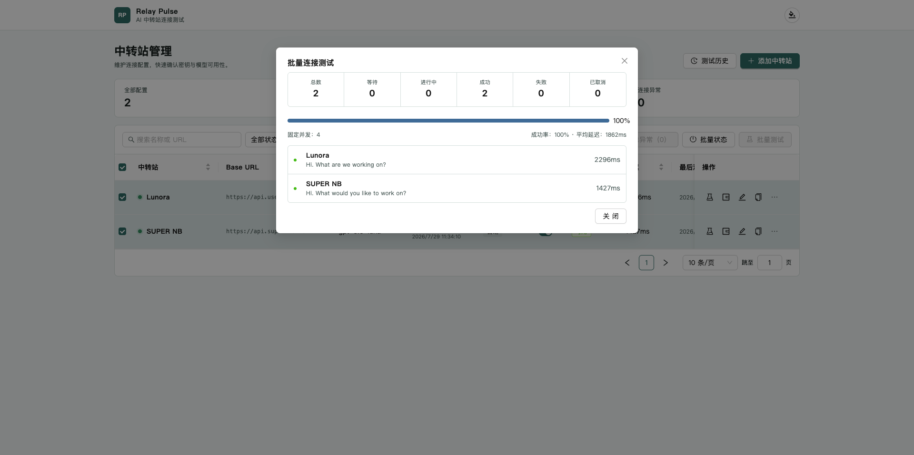
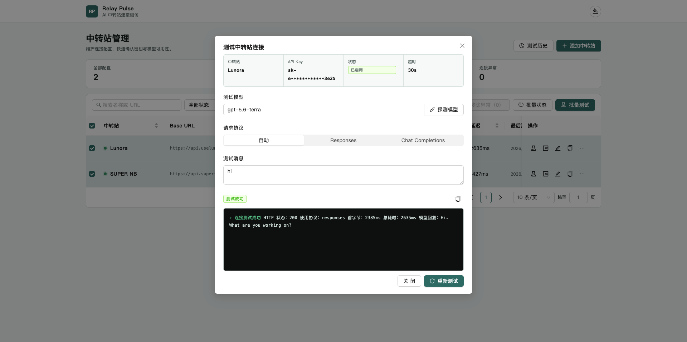

# Relay Pulse

Relay Pulse 是一个本地运行的 AI 中转站连接测试工具。它管理 OpenAI 兼容中转站配置，并通过服务端测试 `/v1/responses`、`/v1/chat/completions` 和 `/v1/models`，避免浏览器 CORS 与密钥暴露问题。

项目同时提供普通网页和 WebExtension 两种前端形态。浏览器扩展支持 Chrome、Edge、Brave、Opera 等 Chromium 浏览器及 Firefox；点击扩展图标会在新标签页打开完整管理界面。扩展仍依赖本机 Node.js 后端，避免把完整 API Key 和中转站请求放进浏览器端。

## 功能

- 中转站配置增删改查、复制、批量启停
- API Key 服务端保存、接口脱敏、编辑留空保留原 Key
- Responses、Chat Completions 与自动回退模式
- 模型列表探测、默认发送 `hi` 的单连接测试
- 固定并发批量测试、停止任务、重试失败项
- 测试历史筛选、单条删除与清空，默认最多保留 1000 条
- 浅色、深色、跟随系统主题及响应式界面
- JSON 串行原子写入，无数据库依赖

## 界面预览

### 批量测试



### 单个测试



## 环境要求

- Node.js 18.17 或更高版本
- npm 9 或更高版本

## 安装与运行

```bash
npm install
cp .env.example .env
npm run dev
```

- 前端：http://127.0.0.1:5173
- 后端：http://localhost:3100
- 健康检查：http://localhost:3100/api/health

也可以分别运行：

```bash
npm run dev:server
npm run dev:client
```

## 构建与检查

```bash
npm run typecheck
npm run lint
npm test
npm run build
```

生产构建后可执行 `npm run start -w server` 启动 API；`client/dist` 可由任意静态服务器托管，并将 `/api` 反向代理到后端。

## 浏览器扩展

生成扩展目录和安装包：

```bash
npm run build:extension
```

启动扩展所需的本地后端：

```bash
npm run start:extension
```

构建产物位于：

- `extension/dist`：所有支持浏览器可加载的解压目录
- `extension/packages/relay-pulse-chromium.zip`：Chrome、Edge、Brave、Opera 分发包
- `extension/packages/relay-pulse-firefox.xpi`：Firefox 本地测试包

### 下载

无需本地构建时，可直接下载 Chromium 浏览器扩展安装包：[relay-pulse-chromium.zip](https://github.com/YangWenLong123/Relay-Pulse/blob/main/extension/packages/relay-pulse-chromium.zip)。下载并解压后，在 Chrome、Edge、Brave 或 Opera 的扩展管理页开启开发者模式，再选择“加载已解压的扩展程序”。

Chromium 浏览器需要在扩展管理页开启开发者模式，使用“加载已解压的扩展程序”选择 `extension/dist`。Firefox 在 `about:debugging#/runtime/this-firefox` 中选择“临时载入附加组件”，再选择 XPI 或 `manifest.json`。详细步骤见 [extension/README.md](extension/README.md)。

Firefox 稳定版不允许永久安装未签名 XPI；本地产物可临时加载，永久安装需要提交 Mozilla AMO 签名。Safari 需要通过 Xcode 的 Web Extension Converter 转换和签名，不属于可直接拖入安装的通用产物。

## 配置

根目录 `.env` 支持：

| 变量 | 默认值 | 说明 |
| --- | --- | --- |
| `SERVER_PORT` | `3100` | API 端口 |
| `SERVER_HOST` | `127.0.0.1` | API 监听地址；默认仅允许本机访问 |
| `CLIENT_ORIGIN` | `http://localhost:5173` | 允许的网页前端来源，多个值使用英文逗号分隔 |
| `ALLOW_EXTENSION_ORIGINS` | `true` | 是否允许格式合法的浏览器扩展来源访问本机 API |
| `DATA_DIR` | `./data` | JSON 数据目录 |
| `HISTORY_LIMIT` | `1000` | 历史记录上限 |
| `BATCH_CONCURRENCY` | `4` | 服务端批测并发数，最高 10 |
| `API_KEY_ENCRYPTION_SECRET` | 空 | 可选；设置后使用 AES-256-GCM 加密本地 API Key |
| `VITE_API_BASE_URL` | `/api` | 前端 API 地址，配置在 `client/.env*` 中 |

Vite 的环境变量需要放在 `client/.env` 中。开发环境默认通过 Vite 代理访问本地 API，因此通常不需要额外配置。扩展模式使用 `client/.env.extension`，默认连接 `http://127.0.0.1:3100/api`。

## 数据与安全

数据保存在：

- `data/relays.json`
- `data/test-history.json`

两个文件会在首次启动时创建，使用临时文件原子替换并串行写入，文件权限为当前用户可读写，且已在 `.gitignore` 中排除。JSON 损坏时服务会明确报错并保留原文件，不会自动覆盖。

默认情况下，API Key 因测试请求需要会以明文保存在 `data/relays.json`。本工具仅适用于可信本地环境。建议在 `.env` 设置高强度的 `API_KEY_ENCRYPTION_SECRET`；服务启动时会将已有明文 Key 自动迁移为 AES-256-GCM 密文。该密钥不会写入数据文件，必须单独安全备份；丢失或修改后原数据无法解密。列表、详情、历史和错误响应始终不会返回完整 Key。

服务默认只监听 `127.0.0.1`。扩展来源放行仅适用于这个可信本地运行模式；如需部署到公网，应关闭 `ALLOW_EXTENSION_ORIGINS`，并增加身份认证、访问控制和 HTTPS，同时启用密钥加密存储。

DNS、TCP 与 TLS 分段耗时在 Node 原生 Fetch 中无法可靠获取，因此返回 `null`；首字节耗时使用收到响应头的时间，总耗时覆盖整个测试过程。

## API

主要接口位于 `/api`：

- `GET/POST /relays`
- `GET/PUT/DELETE /relays/:id`
- `POST /relays/:id/test`
- `DELETE /relays/:id/test`（取消执行中的测试）
- `GET /relays/:id/models`
- `POST /relays/batch-test`
- `PATCH /relays/batch`
- `POST /models/discover`
- `GET/DELETE /test-history`
- `DELETE /test-history/:id`

## 开源协议

本项目采用 [MIT License](LICENSE) 开源。
